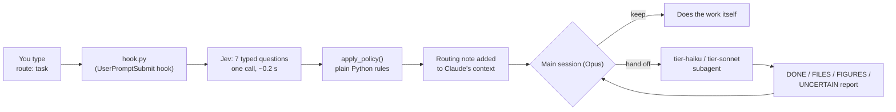

# Design: a risk-aware model router for Claude Code

This document explains **what the router is for, how it decides, and why it is built this way**.
For the history of individual decisions, see [DECISIONS.md](DECISIONS.md). For how well it works,
see [EVALUATION.md](EVALUATION.md).

## 1. The problem

Running every task on the most capable Claude model (Opus) is the safe default, but it uses up a
plan's session limits fastest. Much of a working day is not judgment work: downloading filings,
checking links, pulling a table out of a document, fixing a script. Cheaper models (Sonnet, Haiku)
can do much of that, at lower cost.

The catch is the work itself: **healthcare valuation and transaction advisory**. In finance, the
dangerous failure is not a crash; it is a *plausible wrong number* that flows into a model or memo.
So the router cannot simply send "easy-looking" work to the cheapest model. It has to ask two
separate questions, the way a deal team staffs work:

1. **Who is allowed to do this?** The lowest model whose mistakes would be caught rather than
   believed. That depends on risk (does a number or a judgment come out of it?) and on capability
   (can the model actually do the steps?).
2. **Is handing it off worth it?** Delegating has its own cost: writing a brief, a subagent starting
   from scratch, and reading its result back. For a small task, that overhead can cost more than
   just doing the work.

## 2. Goals and non-goals

**Goals**
- Use a cheaper model only where it is both **safe** (risk) and **able** (capability).
- Hand work off only where handing off **actually saves usage**.
- Never trade accuracy for savings: when in doubt, route **up**, never down.
- Make every decision **visible and logged**, so the rules can be tuned against real use.

**Non-goals**
- Not a general cost optimizer. It is tuned to one person's finance workflow and rules.
- Not automatic model switching. A Claude Code hook can't change the session's model (see §6), so
  the router advises and the main session acts.
- Not a replacement for review. Figures from a subagent are still checked against their cited sources.

## 3. How it works

1. You start a prompt with `route:`. Prompts without it are ignored and never leave your machine.
2. `hook.py` sends the task text to **Jev**, TypeSafe's fast judgment model, with seven questions.
   Jev returns *probabilities and scores*, not prose.
3. `apply_policy()` turns those numbers into two answers: **tier** (the lowest model allowed) and
   **hand off or keep**. This part is ordinary Python: no AI, fully unit-tested.
4. The hook prints a short routing note, which Claude Code adds to the conversation.
5. The main session (Opus) follows the note: it either does the work itself or hands it to a tier
   subagent, which ends with a fixed report format so problems can't be buried.

An Excel analogy: Jev fills in the **input cells** (probabilities), `apply_policy()` is the
**formula block** that turns inputs into the answer, and `routing_log.jsonl` is the **audit trail**.
Because inputs and formulas are kept separate, changing a threshold never needs new API calls: the
saved inputs are simply re-run through the new formulas.

## 4. The seven questions Jev answers

All seven go in one request and are answered in parallel. None of them sees the others' answers.

| Question | Type | Purpose |
|---|---|---|
| `tier` | Choice: haiku / sonnet / opus | Jev's starting pick, judged by decision risk rather than task size |
| `produces_figure` | Yes/no probability | Will a number from this reach a model, memo, or decision? |
| `ambiguous_method` | Yes/no probability | Must a line-item definition, accounting treatment, or valuation method be chosen? |
| `valuation_driver` | Yes/no probability | Does it touch an input that can move the conclusion (discount rate, comps, ...)? |
| `bulk_work` | Yes/no probability | Many independent pieces, or more reading than fits in one session? |
| `web_research` | Yes/no probability | Searching the web and reading several pages? |
| `capability` | Score, 0 to 2 | How open-ended is the work? (one action / a predictable path / open-ended) |

## 5. The rules (`apply_policy`), in order

1. **Start from Jev's tier pick.**
2. **Risk escalation:** if `ambiguous_method` or `valuation_driver` is 0.5 or higher, or Jev's
   confidence in its tier pick is below 0.6, move **up one tier**.
3. **Figure floor:** if `produces_figure` is 0.5 or higher, the tier is **at least Sonnet**. A figure
   sets a minimum; it does not push Sonnet work to Opus.
4. **Capability gate:** if `capability` is 1.5 or higher (leaning open-ended), Haiku isn't trusted,
   so the tier becomes Sonnet.
5. **Hand-off:** below Opus, hand off if `bulk_work` or `web_research` is 0.5 or higher; otherwise
   keep it in the main session. **Opus-tier work is never handed off.**
6. **Override:** `route: [haiku|sonnet|opus] task` forces a tier. Jev still runs and both answers are
   logged. Forcing a tier below the policy's floor is allowed but carries a WARNING.

**Guarantees, enforced by unit tests** (including one that tries every combination of inputs):
- The final tier is never below Jev's pick. Rules only move work up.
- Opus-tier work is never handed off.
- A task that produces a figure never runs on Haiku.
- Any failure (no API key, timeout, bad response) routes the task as Opus work.

## 6. Why it is built this way

**A hook, not a proxy.** A proxy sitting between Claude Code and Anthropic's servers could switch
the model on every request, so the router's choice would be enforced. This project uses a hook plus
subagents instead:
- The main session stays on Opus, which keeps the full conversation and does the judgment and final
  checks.
- Only bulk work leaves, to subagents whose instructions are written for their tier. For example, the
  Haiku subagent is told never to derive a figure.
- It needs no network interception or credential handling.

The cost is that routing is **advisory**: the main session reads the note and follows it.

**Jev, not an Opus "router agent".** The main session is already Opus and already reads every
prompt. A separate Opus subagent acting as router would start from scratch, spend Opus usage on a
decision the main session could make itself, and still not see the conversation. Compared with
letting the main session decide on its own, Jev adds:
- **Consistency:** numeric, logged, testable outputs.
- **Cheap decisions:** about 0.2 s per call, billed by TypeSafe rather than against Claude usage.
- **Tunability:** thresholds can be tuned, which is what makes the router self-refining.

Jev's trade-offs: it sees only the routed prompt, not the conversation ("now do the same for Tenet"
is judged without context), and the prompt text is sent to TypeSafe.

**Hand off only bulk work.** Anthropic's cost guide measured that handing work to cheaper workers
"saved money in only two measured situations. On work a single model could handle alone, the same
model at lower effort was cheaper every time." The two situations were routine work with occasional
runaway runs, and work too large for one context window. The router's bulk and web-research
questions aim at exactly those cases.

**Capability from published limits, not guesses.** Anthropic's Models overview lists concrete Haiku
4.5 limits: a 200K-token context window (versus 1M for Sonnet and Opus) and a Feb 2025 reliable
knowledge cutoff (versus Jun 2026). Those become hard rules in the capability question. Everything
else about capability is **measured**, not predicted.

**Narrow questions.** TypeSafe's build guidance is to ask one narrow, coherent judgment per question.
The one time this project broke that rule, by folding web research into the bulk question, it didn't
work (eval v3). Splitting it into its own question did (eval v4).

## 7. Evidence used

All retrieved 2026-09-28.

| Source | What it contributed |
|---|---|
| [Models overview](https://platform.claude.com/docs/en/models/overview) | Prices (USD per million tokens, input / output): Opus 5.5 $4 / $20, Sonnet 5.5 $2 / $10, Haiku 4.5 $1 / $5. Haiku 4.5: 200K context, 64K max output, Feb 2025 reliable knowledge cutoff, retirement "not sooner than October 15, 2026" |
| [Choosing the right model](https://platform.claude.com/docs/en/about-claude/models/choosing-a-model) | "Efficiency-first": begin with Haiku, test, upgrade only for specific capability gaps. "Tuning effort is often a better lever than switching models." |
| [Optimizing for cost and intelligence](https://platform.claude.com/docs/en/about-claude/models/optimizing-for-cost-and-intelligence) | When delegating pays (quoted above). Haiku 4.5 answered GPQA Diamond questions at "about a fifth of Claude Opus 5.5's cost per question, with 63% accuracy compared with 92%" |
| [Claude Code advisor](https://code.claude.com/docs/en/advisor) | A built-in alternative: a cheaper main model that consults Opus at decision points |
| [Opus 5.5 system card](https://www.anthropic.com/system-cards) | Reviewed; its capability section has no comparison with Sonnet 5.5 or Haiku 4.5, so it didn't inform routing |
| TypeSafe docs and build guidance | Question types (Choice, Noul, Score); one narrow judgment per question |

## 8. Known limitations

- **Advisory, not enforced.** The main session could ignore the note.
- **Jev sees only the prompt text.** Follow-up prompts that rely on earlier conversation are judged
  without it.
- **Routed prompt text goes to TypeSafe.** Keep client names and deal details out of `route:` prompts
  until TypeSafe's data terms have been checked.
- **Small, self-labeled eval.** 37 prompts, labeled by the owner, and tuned on. Run-to-run noise
  already decides a few close calls (see EVALUATION.md).
- **The eval checks routing decisions, not outcomes.** It does not yet check whether a subagent then
  completed the task correctly.
- **Haiku 4.5's earliest possible retirement is 2026-10-15.** The `haiku` alias will need watching
  when a successor ships.

## 9. Related work

[gargpratyush/jev-router](https://github.com/gargpratyush/jev-router) (MIT) routes Claude Code
requests with Jev through a local proxy that swaps the session's model per request, based on task
complexity. This project shares no code with it, and its design choices and their reasons are
recorded in [DECISIONS.md](DECISIONS.md). It differs in using a finance-specific risk gate, treating
tiers as floors, handing off only bulk work, and evaluating against labeled prompts with offline
replay.
